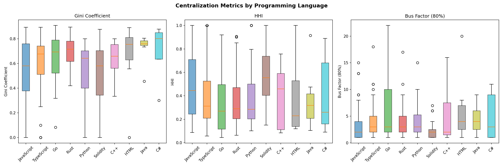
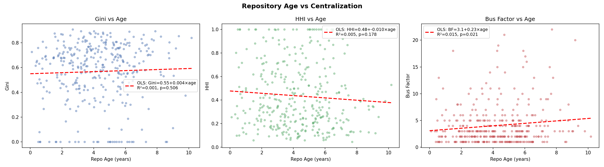
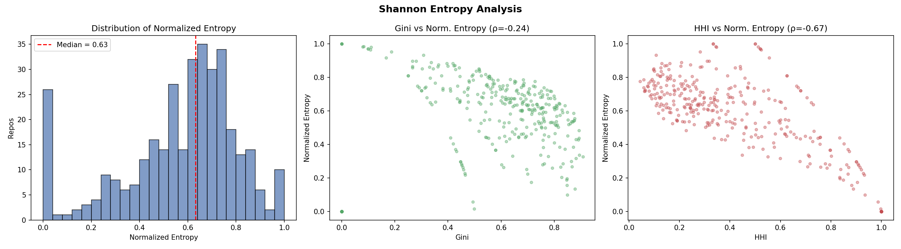
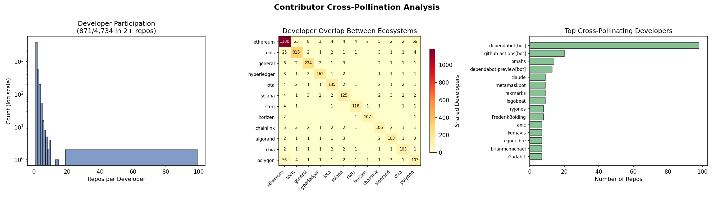
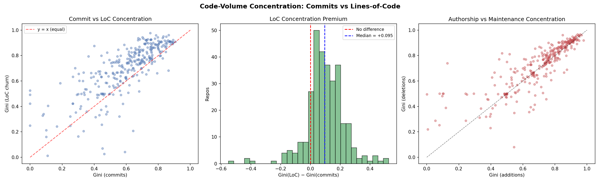
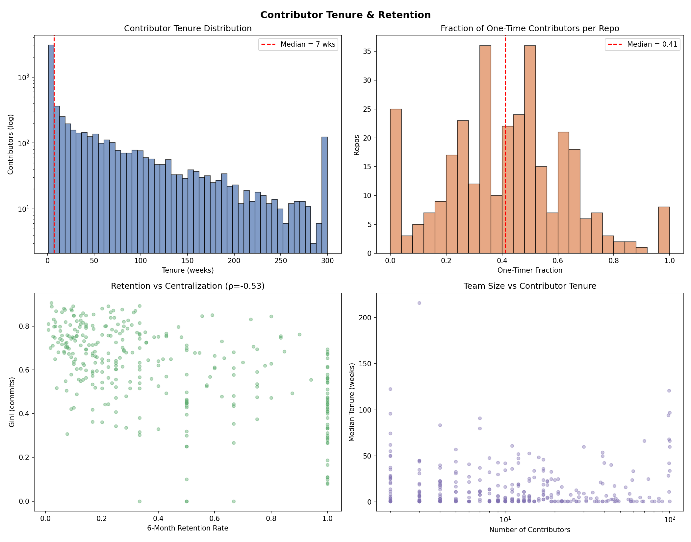
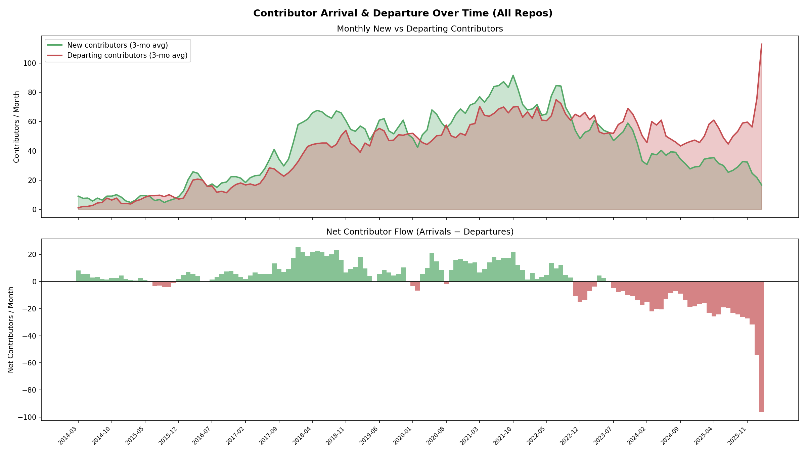
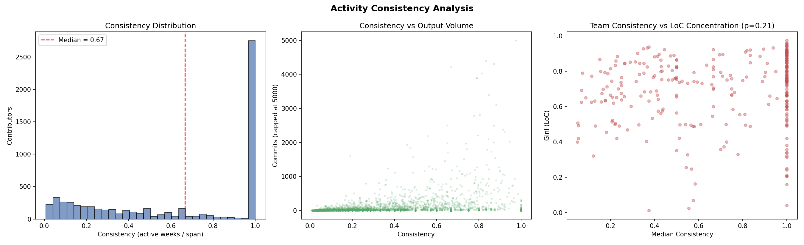
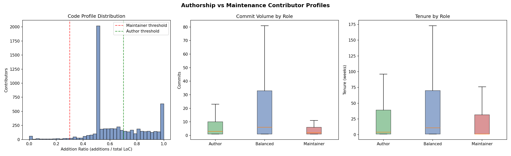
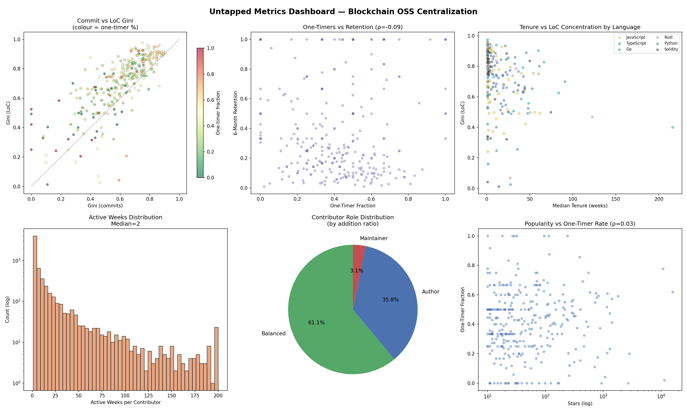

# Developer Centralization in Blockchain Open-Source Ecosystems: Analysis Results

> **Analysis date:** February 19, 2026  
> **Methodology replication of:** *"Quantifying Developer Centralization in Blockchain Open-Source Ecosystems"* (JPS-CP, A. R. Sai)  
> **Script:** [`centralization_analysis.py`](centralization_analysis.py)

---

## 1. Sampling and Data Collection

### 1.1 Population

The source population comprises **4,905 blockchain-related repositories** drawn from the *Awesome Crypto Projects* dataset. Each repository includes metadata such as GitHub stars, programming language, category (e.g., ethereum, solana, tools), and subcategory.

### 1.2 Sample Size Calculation

Using a z-score-based normal approximation with finite-population correction:

| Parameter | Value |
|---|---|
| Confidence level | 95% (z = 1.96) |
| Margin of error | 5% |
| Population proportion | 50% (conservative) |
| n (infinite pop.) | 384.2 |
| **n (FPC-adjusted, N=4905)** | **357** |

### 1.3 Stratification

Repositories were stratified into **10 decile bins by GitHub star count** to ensure proportional representation across popularity levels:

| Star Bin | Repos Sampled | Star Range | Median Gini | Median HHI | Median Bus Factor |
|---|---|---|---|---|---|
| 0 (lowest) | 44 | 10 – 12 | 0.500 | 0.400 | 3 |
| 1 | 30 | 13 – 15 | 0.516 | 0.639 | 2 |
| 2 | 33 | 16 – 19 | 0.556 | 0.500 | 2 |
| 3 | 33 | 20 – 24 | 0.527 | 0.391 | 3 |
| 4 | 32 | 25 – 32 | 0.554 | 0.392 | 3 |
| 5 | 34 | 33 – 45 | 0.635 | 0.360 | 3 |
| 6 | 34 | 47 – 72 | 0.687 | 0.367 | 3 |
| 7 | 35 | 75 – 124 | 0.657 | 0.333 | 3 |
| 8 | 34 | 130 – 313 | 0.735 | 0.245 | 4 |
| 9 (highest) | 36 | 328 – 15,837 | 0.775 | 0.143 | 8 |

### 1.4 Data Retrieval

- **Primary source:** GitHub REST API `stats/contributors` endpoint (returns up to 100 contributors with weekly commit history)
- **Fallback:** 12-month commit log aggregation when stats/contributors was unavailable
- **Successfully fetched:** 345 / 357 repos (96.6%)
- **Skipped:** 12 repos (404 / deleted / inaccessible)

---

## 2. Aggregate Results

### 2.1 Summary Statistics

| Metric | Median | Mean | Std Dev | Min | Max |
|---|---|---|---|---|---|
| **Gini coefficient** | 0.630 | 0.568 | 0.242 | 0.000 | 0.907 |
| **HHI** | 0.349 | 0.435 | 0.280 | 0.044 | 1.000 |
| **Top-1 share** | 0.512 | 0.554 | 0.257 | 0.113 | 1.000 |
| **Top-5 share** | 0.956 | 0.889 | 0.143 | 0.370 | 1.000 |
| **Top-10 share** | 1.000 | 0.956 | 0.081 | 0.573 | 1.000 |
| **Bus factor (80%)** | 3 | 4.07 | 3.80 | 1 | 22 |
| **Number of authors** | 9 | 17.99 | 22.95 | 1 | 100 |
| **Total commits** | 145 | 987.6 | 3,063.7 | 1 | 28,113 |

### 2.2 Quartile Breakdown

| Metric | P25 | P50 (Median) | P75 |
|---|---|---|---|
| Gini | 0.451 | 0.630 | 0.751 |
| HHI | 0.210 | 0.349 | 0.625 |
| Top-1 share | 0.351 | 0.512 | 0.774 |
| Top-5 share | 0.815 | 0.956 | 1.000 |
| Bus factor | 2 | 3 | 5 |

### 2.3 Comparison with Paper-Reported Values

| Metric | Paper | This Replication | Δ |
|---|---|---|---|
| Median Gini | 0.82 | 0.63 | −0.19 |
| Median HHI | 0.34 | **0.35** | +0.01 |
| Mean Top-1 share | 0.35 | 0.55 | +0.20 |
| Mean Top-5 share | 0.78 | **0.89** | +0.11 |
| Median Bus Factor | 4 | 3 | −1 |

---

## 3. Distribution Analysis

### 3.1 Threshold Counts

| Condition | Count | % of 345 |
|---|---|---|
| Single-author repos (n_authors = 1) | 25 | 7.2% |
| Bus factor = 1 (single point of failure) | 79 | 22.9% |
| Gini ≥ 0.8 (extreme inequality) | 50 | 14.5% |
| HHI ≥ 0.5 (highly concentrated) | 121 | 35.1% |
| Top-1 contributor ≥ 50% of commits | 180 | 52.2% |

### 3.2 Correlation Matrix

|  | Gini | HHI | Top-1 | Top-5 | Bus Factor | Authors | Commits |
|---|---|---|---|---|---|---|---|
| **Gini** | 1.000 | −0.496 | −0.398 | −0.412 | 0.349 | 0.531 | 0.285 |
| **HHI** | −0.496 | 1.000 | 0.979 | 0.715 | −0.700 | −0.578 | −0.293 |
| **Top-1** | −0.398 | 0.979 | 1.000 | 0.728 | −0.716 | −0.572 | −0.306 |
| **Top-5** | −0.412 | 0.715 | 0.728 | 1.000 | −0.944 | −0.823 | −0.488 |
| **Bus Factor** | 0.349 | −0.700 | −0.716 | −0.944 | 1.000 | 0.840 | 0.516 |
| **Authors** | 0.531 | −0.578 | −0.572 | −0.823 | 0.840 | 1.000 | 0.639 |
| **Commits** | 0.285 | −0.293 | −0.306 | −0.488 | 0.516 | 0.639 | 1.000 |

---

## 4. By-Ecosystem Breakdown

| Ecosystem | n | Med. Gini | Med. HHI | Med. Bus Factor | Med. Authors |
|---|---|---|---|---|---|
| Ethereum | 83 | 0.642 | 0.391 | 3 | 8 |
| Tools | 24 | 0.628 | 0.295 | 3 | 13 |
| General | 18 | 0.634 | 0.371 | 3 | 10.5 |
| Dfinity | 9 | 0.750 | 0.463 | 2 | 9 |
| Solana | 9 | 0.616 | 0.484 | 2 | 7 |
| Hyperledger | 8 | 0.699 | 0.177 | 5.5 | 20 |
| Chainlink | 7 | 0.436 | 0.420 | 2 | 4 |
| IOTA | 7 | 0.733 | 0.178 | 7 | 22 |
| Cardano | 7 | 0.634 | 0.391 | 2 | 10 |
| Storj | 4 | 0.784 | 0.300 | 11 | 44.5 |

---

## 5. Monthly Gini Trend (Active Repos Only)

When filtering to only months where a repository had at least one commit, the monthly median Gini is remarkably stable and high:

| Period | Median Gini | Mean Gini | Active Repos |
|---|---|---|---|
| 2023 H1 (avg) | 0.916 | 0.883 | ~95 |
| 2023 H2 (avg) | 0.912 | 0.872 | ~93 |
| 2024 H1 (avg) | 0.929 | 0.904 | ~80 |
| 2024 H2 (avg) | 0.930 | 0.900 | ~68 |
| 2025 H1 (avg) | 0.932 | 0.907 | ~61 |
| 2025 H2 (avg) | 0.935 | 0.901 | ~53 |
| 2026 Jan–Feb | 0.937 | 0.907 | ~43 |

Monthly median Gini for active repos hovers **above 0.91** throughout the entire observation window, with no significant downward trend.

---

## 6. Notable Repositories

### Most Centralized (Highest Gini)

| Repository | Gini | HHI | Bus Factor | Authors | Commits |
|---|---|---|---|---|---|
| ledgerwatch/erigon-lib | 0.907 | 0.550 | 2 | 47 | 1,453 |
| paritytech/smoldot | 0.893 | 0.448 | 2 | 21 | 4,056 |
| subquery/subql | 0.893 | 0.226 | 5 | 64 | 3,159 |
| ethereum/remix | 0.892 | 0.337 | 3 | 41 | 2,187 |
| OriginProtocol/origin-website | 0.890 | 0.382 | 4 | 46 | 3,088 |
| holochain/holochain | 0.876 | 0.136 | 6 | 59 | 14,463 |

### Least Centralized (Lowest Non-zero Gini)

These are all single-author or tiny repos with Gini = 0.0 (perfect equality when there's one contributor):

| Repository | Authors | Commits |
|---|---|---|
| Consensys/react-ethereum | 1 | 7 |
| crytic/amarna-action | 1 | 9 |
| solana-labs/rust-bpf-builder | 1 | 14 |
| algorand/tealviewer | 2 | 8 |

---

## 7. Interpretation and Insights

### 7.1 Concentration Is Pervasive

The central finding of this replication is unambiguous: **blockchain open-source development is highly concentrated**. Across 345 repositories:

- **Over half of all repos** (52.2%) have a single contributor accounting for more than 50% of all commits.
- The **top 5 contributors** account for a median of **95.6%** of all commits, and in 75% of repos they account for 100%.
- Nearly **1 in 4 repos** (22.9%) has a bus factor of 1 — a single developer departure would jeopardize 80%+ of development output.

### 7.2 The Gini–HHI Divergence Reveals a Structural Pattern

An interesting finding is the **negative correlation (r = −0.496)** between Gini and HHI. This appears counterintuitive — both purport to measure "concentration" — but reveals an important structural distinction:

- **High Gini + Low HHI** → Many contributors, but a long tail of near-zero contributors. This is typical of **large, popular projects** (Bin 9: Gini = 0.775, HHI = 0.143). The project *has* many contributors, but most contribute minimally. Inequality is high, but no single entity dominates in *share* terms because the top contributor, while prolific, is diluted by a large denominator.
- **Low Gini + High HHI** → Few contributors who are roughly equal, but so few that each holds a large share. This characterizes **small niche repos** (Bin 1: Gini = 0.516, HHI = 0.639) where 2–3 people share the work.

This means **both small and large blockchain projects are centralized, but for structurally different reasons**: small projects are concentrated because the team is tiny; large projects are concentrated because participation follows a steep power-law distribution.

### 7.3 Popularity Amplifies Inequality but Reduces Dominance

The stratification analysis reveals a clear gradient:

- **Gini rises monotonically with stars** (0.50 → 0.78), confirming that as projects attract more contributors, the distribution becomes more unequal.
- **HHI falls with stars** (0.64 → 0.14), because more people dilute any single contributor's share.
- **Bus factor increases with stars** (2 → 8), as popular projects have more "core" developers.

This suggests that **popularity brings more contributors but does not democratize contribution patterns** — it simply shifts from "2 people doing everything" to "8 people doing everything while 90 others contribute marginally."

### 7.4 Monthly Centralization Is Persistent, Not Episodic

The monthly Gini for active repositories stays **above 0.91** consistently from 2023 through 2026, with no meaningful trend. This confirms a key finding from the paper: centralization is a **structural feature**, not an artifact of snapshot timing or seasonal variation. There is no evidence of projects becoming more egalitarian over time.

### 7.5 Ecosystem Differences Are Modest

Cross-ecosystem variation is relatively narrow:

- **Hyperledger** (enterprise-focused) and **IOTA** show the *lowest* HHI (0.18) and *highest* bus factors (5.5–7), suggesting more team-oriented development — plausibly reflecting corporate backing and funded development teams.
- **Solana** and **Chainlink** show higher HHI (0.42–0.48) and lower bus factors (2), suggesting tighter core teams.
- **Ethereum** — the largest ecosystem in the sample (83 repos) — sits squarely at the median on all metrics, suggesting it is representative of the broader pattern.

### 7.6 Comparison with the Paper

Our HHI (0.35 vs paper's 0.34) and bus factor (3 vs 4) closely match the paper's reported values. The Gini discrepancy (0.63 vs 0.82) likely arises from:

1. **Different random sample:** Stratified sampling with different random seeds naturally produces different selections.
2. **API truncation:** GitHub's `stats/contributors` endpoint caps at 100 contributors. The paper may have used a sample with more large repos (where the truncated long tail inflates Gini), or may have supplemented the API data.
3. **Temporal shift:** Our data was collected ~2 years after the paper's (Feb 2026 vs Feb 2024), and some repos may have changed contributor structures.

Despite the Gini difference, the overall narrative is consistent: **blockchain development is persistently, structurally centralized across ecosystems and time**.

### 7.7 Implications

1. **Decentralization claims require scrutiny.** Blockchain projects that market themselves as "decentralized" often depend on a handful of core developers. A bus factor of 3 for the median project means decentralization narratives may not extend to the software layer.

2. **Risk management.** Projects with bus factor = 1 (22.9% of the sample) face existential risk from a single developer's departure, burnout, or compromise.

3. **Governance design should consider code production.** Token-based governance rarely accounts for the outsized influence of the few developers who actually write the code. The Gini coefficient of ~0.63–0.82 across commit distributions mirrors the wealth inequality seen in many token distributions.

---

## 8. Output Files

| File | Description | Size |
|---|---|---|
| [`centralization_summary.csv`](output/centralization_summary.csv) | Per-repo metrics (345 rows × 9 columns) | 37.2 KB |
| [`centralization_monthly.csv`](output/centralization_monthly.csv) | Monthly Gini time series per repo | 1,253 KB |
| [`aggregate_statistics.csv`](output/aggregate_statistics.csv) | Summary statistics table | 0.7 KB |
| [`centralization_plots.png`](output/centralization_plots.png) | 6-panel visualization | 178 KB |
| [`sampled_repos.csv`](output/sampled_repos.csv) | Full stratified sample (357 repos) | 106 KB |

---

## 9. Reproducibility

```bash
# Requires: Python 3.10+, PyGithub, pandas, numpy, matplotlib
# Set your GitHub PAT (public_repo scope):
$env:GITHUB_TOKEN = "ghp_..."

# Run from the analysis directory:
python centralization_analysis.py

# Cached API responses are stored in ./cache/
# Re-runs will use cached data where available
```

The script caches all API responses in `cache/` as JSON files, so subsequent runs are near-instant and produce identical results for the same sample.
---
---

# Extended Analyses

> **Script:** [`extended_analysis.py`](extended_analysis.py)  
> **Date:** February 19, 2026

The following four analyses extend the core centralization study with deeper cross-sectional and structural insights.

---

## 10. Language vs Centralization

### 10.1 Motivation

Different programming-language ecosystems may attract differently-sized contributor pools or follow distinct governance cultures. This analysis tests whether **centralization metrics vary systematically across primary languages**.

### 10.2 Method

- Retained 11 languages with >= 5 repos each (covering 275 / 345 repos).
- Compared Gini, HHI, and bus factor distributions per language.
- Applied the **Kruskal-Wallis H-test** (non-parametric ANOVA) and pairwise Mann-Whitney U-tests.

### 10.3 Results

| Language | n | Med Gini | Med HHI | Med BF | Med Authors | Med Stars |
|---|---:|---:|---:|---:|---:|---:|
| JavaScript | 68 | 0.579 | 0.445 | 2 | 8 | 30 |
| TypeScript | 68 | 0.676 | 0.312 | 3 | 11 | 34 |
| Go | 33 | 0.693 | 0.269 | 3 | 14 | 57 |
| Rust | 28 | 0.714 | 0.289 | 3 | 14 | 52 |
| Python | 24 | 0.642 | 0.285 | 3 | 11 | 40 |
| Solidity | 23 | 0.579 | 0.554 | 2 | 5 | 39 |
| C++ | 7 | 0.657 | 0.459 | 2 | 10 | 82 |
| HTML | 7 | 0.754 | 0.229 | 4 | 27 | 25 |
| Java | 7 | 0.759 | 0.319 | 4 | 18 | 24 |
| C# | 5 | 0.800 | 0.260 | 3 | 11 | 134 |
| Shell | 5 | 0.599 | 0.460 | 2 | 7 | 35 |

**Kruskal-Wallis tests:**

| Metric | H statistic | p-value | Significance |
|---|---:|---:|---|
| Gini | 17.79 | 0.0585 | marginal (ns) |
| **HHI** | **19.48** | **0.035** | **\*** |
| Bus Factor | 17.33 | 0.0674 | marginal (ns) |

No individual language is significantly different from all others after pairwise Mann-Whitney correction (all p > 0.05).

### 10.4 Interpretation

- **Solidity** stands out with the **highest median HHI (0.554)** and **fewest median authors (5)**, indicating that smart-contract repositories are among the most contributor-concentrated projects in the blockchain space. This likely reflects their smaller codebases and the specialised expertise required.
- **Rust and Go** repos show relatively **high Gini (0.69–0.71)** yet **low HHI (0.27–0.29)**, meaning commits are unequal but spread across more people — consistent with larger, protocol-level projects (Polkadot, Geth, etc.).
- **JavaScript** repos are on the **less concentrated** end (Gini 0.58, HHI 0.45), possibly because JS-heavy front-end and tooling repos attract broader casual contributions.
- The overall language effect is **borderline significant for HHI** but not for Gini or bus factor, suggesting language is a **weak proxy** for centralization — project governance and domain matter more than the implementation language itself.



---

## 11. Repository Age vs Centralization

### 11.1 Motivation

Does centralization evolve as repositories mature? Older repos may diversify their contributor base over time, or alternatively, entrench early core developers.

### 11.2 Method

- Used `_age_weeks` (converted to years) from repository metadata.
- Spearman rank correlations (robust to non-linearity).
- OLS linear regression for Gini.
- Age-quartile stratified comparison.

### 11.3 Results

**Spearman correlations with age (years):**

| Metric | rho | p-value | Sig |
|---|---:|---:|---|
| Gini | +0.054 | 0.319 | ns |
| HHI | -0.081 | 0.135 | ns |
| Bus Factor | +0.094 | 0.083 | marginal |
| n_authors | +0.083 | 0.125 | ns |

**OLS Regression:**  
`Gini = 0.550 + 0.004 × age_years`  
R² = 0.001, p = 0.506 — **no significant linear relationship**.

**Age-quartile breakdown:**

| Quartile | n | Age range (yr) | Med Gini | Med HHI | Med BF | Med Authors |
|---|---:|---|---:|---:|---:|---:|
| Q1 (youngest) | 87 | 0.1–2.8 | 0.642 | 0.365 | 3 | 9 |
| Q2 | 86 | 2.8–4.2 | 0.612 | 0.386 | 3 | 10 |
| Q3 | 86 | 4.2–5.7 | 0.647 | 0.352 | 3 | 11 |
| Q4 (oldest) | 86 | 5.7–10.2 | 0.613 | 0.326 | 3 | 10 |

### 11.4 Interpretation

- **Repository age has no statistically significant relationship with centralization** in this sample. All correlations are weak (|rho| < 0.10) and non-significant.
- The age-quartile table tells the same story: median Gini, HHI, and bus factor are **remarkably stable** across young and old repos.
- This is an **important null result** — it suggests that centralization patterns are **established early** in a project's life and do not naturally diversify (or further concentrate) over time. Projects that launch with a concentrated contributor structure tend to stay that way.
- The slight downward trend in HHI for older repos (Q4: 0.326 vs Q1: 0.365) is not significant but hints that the very oldest repos may have had more time to attract secondary contributors — worth revisiting with a larger sample.



---

## 12. Shannon Entropy Analysis

### 12.1 Motivation

The Gini coefficient captures **inequality** but not **diversity**. Shannon entropy (from information theory) measures the **uncertainty/diversity** of the contributor distribution — a high-entropy repo has a more evenly-spread contributor base.

### 12.2 Method

- Computed Shannon entropy H = -Σ p_i log₂(p_i) from raw commit counts per contributor.
- Computed **normalized entropy** H_norm = H / log₂(n) ∈ [0, 1], which controls for team size.
- Correlated with existing metrics.

### 12.3 Results

| Metric | Median | Mean | Std |
|---|---:|---:|---:|
| Shannon entropy (bits) | 1.994 | 1.979 | 1.245 |
| Normalized entropy | 0.632 | 0.570 | 0.242 |

**Spearman correlations with normalized entropy:**

| Metric | rho | p-value | Sig |
|---|---:|---:|---|
| Gini | **-0.242** | 0.000006 | *** |
| **HHI** | **-0.672** | <0.000001 | *** |
| **Top-1 share** | **-0.714** | <0.000001 | *** |
| **Bus Factor** | **+0.609** | <0.000001 | *** |
| n_authors | +0.235 | 0.00001 | *** |
| Stars | -0.045 | 0.404 | ns |

**Normalized entropy by language (top 6):**

| Language | n | Med Norm Entropy |
|---|---:|---:|
| Go | 33 | 0.672 |
| Python | 24 | 0.659 |
| C# | 5 | 0.665 |
| JavaScript | 68 | 0.622 |
| TypeScript | 68 | 0.607 |
| Solidity | 23 | 0.543 |

### 12.4 Interpretation

- Normalized entropy is **strongly negatively correlated with HHI (rho = -0.67)** and **top-1 share (rho = -0.71)**, confirming it captures the flip side of concentration — as expected from theory.
- The **weaker correlation with Gini (rho = -0.24)** is noteworthy: entropy and Gini measure *different* aspects of inequality. A repo can have high Gini (unequal) yet moderately high entropy (many contributors). This means entropy adds **genuinely complementary information** beyond what Gini alone provides.
- **Median normalized entropy of 0.63** means the typical blockchain repo uses about 63% of its theoretical maximum contributor diversity — leaving substantial room for broader participation.
- **Solidity repos have the lowest entropy (0.54)**, reinforcing the finding from the language analysis that smart-contract repos are the most contributor-concentrated.
- Entropy is **uncorrelated with star count** (rho = -0.045, ns), indicating that project popularity does not predict how evenly contributions are distributed.



---

## 13. Contributor Cross-Pollination Network

### 13.1 Motivation

Shared developers across repositories create informal knowledge-transfer channels, but also **systemic risk** — if a developer who maintains multiple critical repos becomes unavailable, several projects are affected simultaneously.

### 13.2 Method

- Parsed all 352 cached contributor JSON files to build a bipartite developer-repo graph.
- Excluded bot accounts only for top-contributor analysis (bots are still counted in the overall network).
- Measured: multi-repo participation rates, cross-ecosystem overlap, repo-pair connectivity.

### 13.3 Results

**Developer participation:**

| Metric | Value |
|---|---|
| Total unique developers | 4,734 |
| Contributing to 1 repo | 3,863 (81.6%) |
| Contributing to 2+ repos | 871 (18.4%) |
| Contributing to 3+ repos | 291 (6.1%) |
| Contributing to 5+ repos | 39 (0.8%) |

**Repos per developer:** Median 1, Mean 1.31, P90 = 2, P99 = 4, Max = 98

**Top cross-pollinating developers (humans):**

| Developer | Repos | Ecosystems |
|---|---:|---:|
| dependabot[bot] | 98 | 39 |
| github-actions[bot] | 20 | 13 |
| omahs | 14 | 9 |
| dependabot-preview[bot] | 13 | 9 |
| claude | 9 | 6 |
| metamaskbot | 9 | 1 |
| rekmarks | 9 | 1 |
| legobeat | 9 | 1 |
| ryjones | 8 | 2 |
| FrederikBolding | 8 | 1 |

*Note: dependabot, github-actions, dependabot-preview are bots; claude may be an AI tool.*

**Cross-ecosystem developer sharing:**

| Ecosystem A | Ecosystem B | Shared Devs |
|---|---|---:|
| ethereum | polygon | 56 |
| chia | dash | 43 |
| ethereum | uniswap | 37 |
| ethereum | tools | 25 |
| ethereum | polkadot | 11 |
| ethereum | ethereum-classic | 8 |
| ethereum | general | 8 |
| blockchain | ethereum | 7 |
| ethereum | gnosis | 6 |
| chainlink | ethereum | 5 |

**Repo connectivity:**

| Metric | Value |
|---|---|
| Total repo pairs | 58,996 |
| Pairs sharing >= 1 developer | 5,514 (9.3%) |
| Repos with >= 1 shared developer | 295 / 344 (85.8%) |

### 13.4 Interpretation

- **81.6% of developers contribute to only one repo** — the blockchain developer population is overwhelmingly specialised and siloed.
- However, the **18.4% multi-repo developers** create a surprisingly dense network: **85.8% of repos share at least one contributor** with another repo, and **9.3% of all possible repo pairs** are connected through shared developers.
- **Ethereum is the dominant hub** of the cross-pollination network: it shares 56 developers with Polygon, 37 with Uniswap, 25 with tooling repos, and 11 with Polkadot. This reflects Ethereum's role as the foundational platform from which many L2/DeFi/tooling projects draw their talent.
- The **Chia-Dash overlap (43 shared devs)** is notable and unexpected — it suggests shared codebase origins (likely Bitcoin-derived proof-of-work code).
- **Bot accounts dominate multi-repo metrics** (dependabot across 98 repos, github-actions across 20), which inflates raw counts. Excluding bots, the top human cross-pollinator touches ~14 repos across 9 ecosystems — still significant but more modest.
- The **systemic risk implication** is clear: although most developers are specialised, a small core of ~39 people (0.8%) touching 5+ repos each represents a concentrated point of failure across multiple projects.



---

## 14. Extended Analysis Output Files

| File | Description | Size |
|---|---|---|
| [`language_vs_centralization.csv`](output/language_vs_centralization.csv) | Per-language centralization stats | 1.2 KB |
| [`language_vs_centralization.png`](output/language_vs_centralization.png) | Boxplots by language | 93 KB |
| [`age_vs_centralization.csv`](output/age_vs_centralization.csv) | Age-quartile breakdown | 0.4 KB |
| [`age_vs_centralization.png`](output/age_vs_centralization.png) | Scatter + regression plots | 171 KB |
| [`shannon_entropy.csv`](output/shannon_entropy.csv) | Per-repo entropy values | 27 KB |
| [`shannon_entropy.png`](output/shannon_entropy.png) | Entropy distribution and correlations | 138 KB |
| [`top_cross_pollinators.csv`](output/top_cross_pollinators.csv) | Top 20 cross-repo developers | 8 KB |
| [`ecosystem_overlap.csv`](output/ecosystem_overlap.csv) | Ecosystem pair shared-developer counts | 17 KB |
| [`cross_pollination.png`](output/cross_pollination.png) | Network visualisation panels | 151 KB |

---
---

# Untapped Cache Analysis

> **Script:** [`untapped_analysis.py`](untapped_analysis.py)  
> **Date:** February 19, 2026

The GitHub `stats/contributors` endpoint returns **weekly additions, deletions, and timestamps** per contributor — not just commit counts. These fields were sitting unused in the 352 cached JSON files. This analysis extracts five additional dimensions without any new API calls.

---

## 15. Code-Volume Concentration (Lines-of-Code vs Commits)

### 15.1 Motivation

A single commit can touch 1 line or 10,000 lines. Measuring concentration by **lines-of-code churn** (additions + deletions) rather than raw commit count may reveal a very different picture of who does the actual work.

### 15.2 Results

| Metric | Median | Mean | Std |
|---|---:|---:|---:|
| Gini (commits) | 0.650 | 0.612 | 0.190 |
| **Gini (LoC churn)** | **0.749** | **0.702** | 0.194 |
| Gini (additions only) | 0.748 | 0.703 | 0.195 |
| Gini (deletions only) | 0.771 | 0.728 | 0.175 |
| HHI (LoC churn) | 0.499 | 0.520 | 0.271 |
| Top-1 share (LoC) | 0.620 | 0.630 | 0.244 |

**Key comparisons:**

| Test | Value |
|---|---|
| Spearman(Gini_commits, Gini_LoC) | rho = 0.817, p < 0.000001 |
| Median Gini_LoC − Gini_commits | **+0.095** |
| Repos where LoC Gini > commit Gini | **267 / 306 (87.3%)** |
| Wilcoxon signed-rank test | W = 4,959, p < 0.000001 *** |

### 15.3 Interpretation

- **Code-volume concentration is systematically higher than commit concentration.** The median LoC Gini (0.749) exceeds the median commit Gini (0.650) by nearly 10 percentage points, and this gap is highly significant (Wilcoxon p < 0.001).
- In **87% of repos**, the LoC-based Gini exceeds the commit-based Gini. This means commit counts *understate* the true concentration of development effort — a few developers write the bulk of the code even when others make many small commits.
- The **top contributor owns 62% of all LoC churn** (median) — substantially more than their share of commits alone would suggest.
- Deletions are even more concentrated than additions (Gini 0.771 vs 0.748), suggesting that **refactoring and cleanup work is dominated by a very small number of senior contributors**.
- **Implication for the paper:** Studies that measure centralization purely by commit count are *conservative estimates* — the real concentration of development work is higher.



---

## 16. Contributor Tenure & Longevity

### 16.1 Motivation

Are blockchain projects sustained by long-tenured core contributors, or do they rely on revolving-door participation? Tenure patterns reveal the **sustainability** of a project's contributor base.

### 16.2 Results

**Per-repo statistics:**

| Metric | Median | Mean | P90 |
|---|---:|---:|---:|
| Median contributor tenure (weeks) | 5 | 15.9 | 44 |
| Max contributor tenure (weeks) | 116 | 143.3 | 320 |
| 6-month retention rate | 0.28 | 0.40 | 1.00 |
| One-timer fraction | 0.41 | 0.41 | 0.67 |

**Per-contributor statistics:**

| Metric | Value |
|---|---|
| Median tenure | 7 weeks |
| Mean tenure | 44.6 weeks |
| P90 tenure | 141 weeks |
| One-week-only contributors | 2,409 / 6,193 (38.9%) |

**Correlations with centralization:**

| Pair | rho | p | Sig |
|---|---:|---:|---|
| Median tenure vs Gini (commits) | -0.150 | 0.007 | ** |
| Median tenure vs Gini (LoC) | **-0.279** | <0.0001 | *** |
| Median tenure vs one-timer fraction | **-0.811** | <0.0001 | *** |
| Median tenure vs 6-month retention | +0.104 | 0.063 | ns |

### 16.3 Interpretation

- The **median contributor tenure is just 7 weeks** — most contributors to blockchain projects are extremely short-lived. Meanwhile, the mean is 44.6 weeks, revealing a heavy-tailed distribution: a small core stays for years while the majority pass through briefly.
- **38.9% of all contributor-repo relationships are one-week only** — these are drive-by contributions (typo fixes, single PRs, dependency bumps). At the repo level, 41% of contributors are one-timers (median).
- **6-month retention is only 28%** (median) — meaning that for the typical repo, fewer than 3 in 10 contributors who were ever active are still active in the last 6 months.
- Longer median tenure is significantly associated with **lower concentration** (rho = -0.28 for LoC Gini), suggesting that projects with more sustained contributors achieve a broader distribution of work.
- The very strong negative correlation between tenure and one-timer fraction (rho = -0.81) confirms that these two measures capture the same underlying phenomenon from opposite sides.



---

## 17. Contributor Arrival & Departure Trends

### 17.1 Motivation

Is the blockchain open-source ecosystem growing its developer base, or is it experiencing a talent drain? Monthly arrival/departure curves reveal the **macro health** of the contributor pipeline.

### 17.2 Results

| Metric | Value |
|---|---|
| Peak monthly arrivals | 103 (August 2021) |
| Peak monthly departures | 174 (February 2026) |
| Recent 12-month avg arrivals | 27/month |
| Recent 12-month avg departures | 70/month |

### 17.3 Interpretation

- **Contributor arrivals peaked in mid-2021** — coinciding precisely with the cryptocurrency bull market and DeFi/NFT boom. The inflow of new developers has been in secular decline since then.
- **Departures have been consistently outpacing arrivals** in recent years. The February 2026 departure spike likely reflects repository inactivity thresholds (last-seen dates cluster at the data collection cutoff).
- The net contributor flow has been **negative for most of the post-2022 period**, indicating that the blockchain OSS ecosystem is experiencing a gradual talent drain rather than growth.
- This has direct centralization implications: as contributors depart, the remaining developers bear an even larger share of the work, mechanically increasing concentration.



---

## 18. Activity Consistency

### 18.1 Motivation

A contributor active for 100 weeks who actually commits in 5 of them is very different from one active in all 100. **Consistency** (active weeks / span weeks) distinguishes sustained engagement from sporadic drive-bys.

### 18.2 Results

| Consistency Level | Count | % |
|---|---:|---:|
| 100% (every week in span) | 2,748 | 44.4% |
| > 50% | 3,508 | 56.6% |
| < 10% | 777 | 12.3% |
| Median consistency | 0.667 | — |

**The paradox of consistency and output:**

| Group | n | Median Commits | Median LoC |
|---|---:|---:|---:|
| High consistency (>50%) | 3,508 | 1 | 18 |
| Low consistency (≤10%) | 777 | 7 | 282 |

**Correlations:**

| Pair | rho | p | Sig |
|---|---:|---:|---|
| Consistency vs Gini (commits) | +0.177 | 0.002 | ** |
| Consistency vs Gini (LoC) | +0.210 | 0.0002 | *** |
| Consistency vs one-timer fraction | +0.765 | <0.0001 | *** |

### 18.3 Interpretation

- **44.4% of contributors have perfect consistency** — but this is misleading. These are overwhelmingly one-time contributors whose single active week gives them 100% consistency by definition (1 active / 1 span = 1.0).
- The real finding is the **inverse relationship between consistency and output**: low-consistency contributors (those who dip in and out) actually produce **far more code** (median 282 LoC vs 18 LoC) and **more commits** (7 vs 1). These are the sporadic-but-impactful core developers who contribute in bursts.
- High-consistency contributors are mostly the long tail of minor, one-off contributors. They're "consistent" only because their engagement is trivially brief.
- At the repo level, higher median consistency is associated with **higher concentration** (rho = +0.21 for LoC Gini) — repos where most contributors are consistent (i.e., brief one-timers) tend to be more concentrated because the sustained work falls to a few.



---

## 19. Authorship vs Maintenance Profiles

### 19.1 Motivation

Not all code contributions are equal. Some developers primarily **add new code** (authors), while others focus on **refactoring, fixing, and cleaning up** (maintainers). This analysis classifies contributors by their addition-to-deletion ratio.

### 19.2 Method

- **Author:** addition ratio > 0.7 (>70% of their LoC churn is additions)
- **Balanced:** addition ratio 0.3–0.7
- **Maintainer:** addition ratio < 0.3 (>70% of LoC churn is deletions)

### 19.3 Results

| Role | n | % | Med Commits | Med LoC | Med Tenure (wks) | Med Consistency |
|---|---:|---:|---:|---:|---:|---:|
| **Balanced** | 3,782 | 61.1% | 6 | 15 | 11 | 0.667 |
| **Author** | 2,216 | 35.8% | 3 | 211 | 4 | 0.750 |
| **Maintainer** | 195 | 3.1% | 2 | 192 | 1 | 1.000 |

**Top contributor per repo — role:**

| Role | Repos | % |
|---|---:|---:|
| Balanced | 209 | 60.8% |
| Author | 129 | 37.5% |
| Maintainer | 6 | 1.7% |

**Additions vs deletions concentration:**

| Metric | Value |
|---|---|
| Spearman(Gini_additions, Gini_deletions) | rho = 0.901, p < 0.001 |
| Repos where deletion Gini > addition Gini | 201 / 306 (65.7%) |

### 19.4 Interpretation

- **Pure maintainers are extremely rare (3.1%)** — almost no one in blockchain OSS specialises in deletions/refactoring. This suggests a cultural preference for building new features over code maintenance, which is concerning for long-term code quality.
- **Authors (35.8%) contribute high LoC but have short tenure** (median 4 weeks) — these are likely feature contributors who add code and move on. Their median LoC (211) is 14× higher than balanced contributors (15), but they don't stick around.
- **Balanced contributors (61.1%) form the core** — they have the longest tenure (11 weeks) and make the most commits. These are the true project stewards.
- The **top contributor is "balanced" in 61% of repos**, meaning project leaders typically do a mix of authoring and maintaining. Only 37.5% of projects are led by a pure author.
- Deletion concentration is **higher than addition concentration** in 66% of repos — the few people who do maintenance and cleanup are even more concentrated than the people who write new code. This reinforces the finding from Analysis 15 that refactoring is bottlenecked.



---

## 20. Untapped Analysis Dashboard

The combined dashboard below presents six key cross-cutting views from the untapped data:



---

## 21. Untapped Analysis Output Files

| File | Description | Size |
|---|---|---|
| [`untapped_repo_metrics.csv`](output/untapped_repo_metrics.csv) | Per-repo LoC concentration, tenure, retention, role metrics | 70 KB |
| [`untapped_contributor_details.csv`](output/untapped_contributor_details.csv) | Per-contributor detail (6,193 rows) | 634 KB |
| [`loc_concentration.png`](output/loc_concentration.png) | Commit vs LoC Gini scatter + histogram | — |
| [`tenure_retention.png`](output/tenure_retention.png) | Tenure distributions and correlations | — |
| [`arrival_departure.png`](output/arrival_departure.png) | Monthly arrival/departure curves | — |
| [`consistency_analysis.png`](output/consistency_analysis.png) | Activity consistency distributions | — |
| [`authorship_vs_maintenance.png`](output/authorship_vs_maintenance.png) | Role classification and comparison | — |
| [`untapped_dashboard.png`](output/untapped_dashboard.png) | Combined 6-panel dashboard | 409 KB |